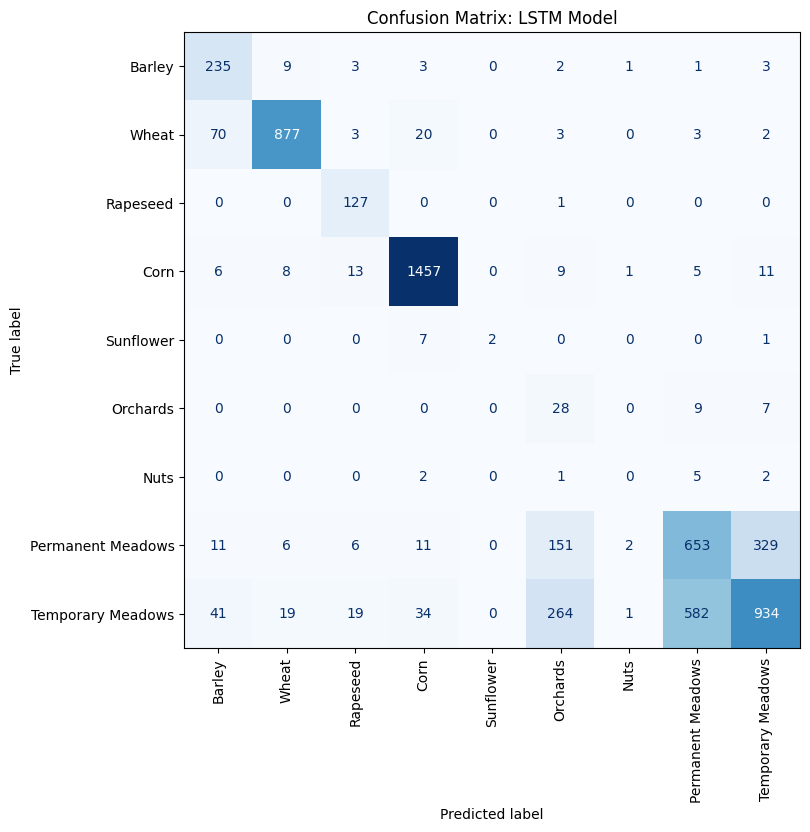

# BreizhCrops Crop Classification

This repository includes the code for a project on crop classification using the BreizhCrops dataset, which provides Sentinel-2 time-series for field polygons in France alongside crop type labels.[1] More detailed description of the methodology used is available [here](https://github.com/harryfyjiswalker/BreizhCrops_Crop_Classification/blob/main/BreizhCrops_WriteUp.pdf).

### Summary of Workflow and Results

Given RAM limitations, we downsample the training/ validation set to 28,000, addressing imbalance via OHIT oversampling and data augmentation of minority classes (limited at 50% synthetic data). Linear interpolation and Savitzky-Golay filtering are employed for gap filling and temporal smoothing, respectively. Fourteen additional vegetation indices (VI) are initially computed and added to the feature set, before RobustScaler is applied to the raw spectral bands, given the typically non-Gaussian, heavily skewed nature of Sentinel-2 reflectance data. We evaluate five architectures on a spatially held-out test set of 6,000 samples: U-Net, U-Net with Temporal Attention Gates, InceptionTime, Transformer, and LSTM. Ablation studies involved incorporation of infrequency class weighting, which proved harmful to performance, and sequential forward selection of VIs based on mutual information scores, which revealed MTVI2 as the most predictive VI, with additional VIs affording minimal additional predictive power. 

The LSTM exhibits the highest Average Accuracy (0.63) and Overall Accuracy (0.72), outperforming existing benchmarks on the first metric [1], despite using a substantially smaller training set:

<div align="center">

| Metric                     | Value  |
|---------------------------|-------:|
| Overall Accuracy (OA)     | 0.7188 |
| Balanced Accuracy         | 0.6285 |
| Macro F1-Score            | 0.5621 |
| Macro Jaccard Index (IoU) | 0.4632 |

</div>

The per-class performance and confusion matrix are displayed below. While oversampling improves minority class performance, per-class F1-scores remain low. In some cases, the model struggles to differentiate between barley and wheat; while distinction of meadows from other crops is reasonably successful, distinguishing between permanent and temporary meadows is another challenge. The most common crops, wheat and corn, are successfully classified in the large majority of cases.

<div align="center">


| Class ID | Class Name         | Support | Precision | Recall | F1-Score |
|:--------:|--------------------|--------:|----------:|-------:|---------:|
| 0        | Barley             | 257     | 0.6474    | 0.9144 | 0.7581   |
| 1        | Wheat              | 978     | 0.9543    | 0.8967 | 0.9246   |
| 2        | Rapeseed           | 128     | 0.7427    | 0.9922 | 0.8495   |
| 3        | Corn               | 1510    | 0.9498    | 0.9649 | 0.9573   |
| 4        | Sunflower          | 10      | 1.0000    | 0.2000 | 0.3333   |
| 5        | Orchards           | 44      | 0.0610    | 0.6364 | 0.1113   |
| 6        | Nuts               | 10      | 0.0000    | 0.0000 | 0.0000   |
| 7        | Permanent Meadows  | 1169    | 0.5191    | 0.5586 | 0.5381   |
| 8        | Temporary Meadows  | 1894    | 0.7246    | 0.4931 | 0.5869   |

</div>

<p align="center">
  
</p>

### Code and Data

The code is available at [COMP0173_Crop_Classiciation](COMP0173_Crop_Classification.ipynb), produced in Google Colab. To reproduce the results:
1. Create a Google Drive folder entitled 'COMP0173_Applying_New_Context' in your main drive; within this, create a folder entitled 'data' (this will match the data path to that used in the code: DATA_PATH = '/content/drive/MyDrive/COMP0173_Applying_New_Context/data'). The code for mounting the drive is available in the .ipynb file.
2. Run code cell 1 (!pip install breizhcrops)
3. Due to an unresolvable compatibility issue, the datasets must then be downloaded in the following way:
   - In code cell 2, change "dataset = bzh.BreizhCrops("frh03", level="L2A")" to "dataset = bzh.BreizhCrops("frh01", level="L2A")". Run this cell.
   - In code cell 3, change "REGIONS_TO_EXTRACT: List[str] = ["frh04"]" to "REGIONS_TO_EXTRACT: List[str] = ["frh01"]" and run this cell to locally download (X_raw_frh01.npy and y_raw_frh01.npy)
   - Repeat this process for frh02, frh03, and frh04. You should now have files named X_raw_frh0X.npy and y_raw_frh0X.npy for X=1,2,3,4 locally downloaded; if not, please change the names to this form.
   - Upload all files to the "data" folder in your Google Drive.
   - Mount Google Drive using code cell 4, and run code cell 5 to confirm the following output:
```text
Listing files in: /content/drive/MyDrive/COMP0173_Applying_New_Context/data

y_raw_frh01.npy
y_raw_frh02.npy
X_raw_frh02.npy
X_raw_frh01.npy
y_raw_frh04.npy
X_raw_frh04.npy
X_raw_frh03.npy
y_raw_frh03.npy
```


The remainder of the .ipynb file will now be reproducible.

________________

Code documenting my reproduction of the initial baseline is available at [COMP0173_Baseline_Replication](COMP0173_Baseline_Replication.ipynb); instructions for replication of this code is included in the .ipynb file.

### References

[1] Rußwurm, M., Pelletier, C., Zollner, M., Lefèvre, S. and Körner, M. (2020) ‘BreizhCrops: A Time Series Dataset for Crop Type Mapping’, arXiv preprint arXiv:1905.11893. Available at: https://arxiv.org/abs/1905.11893 (Accessed: 6 May 2026).


  
